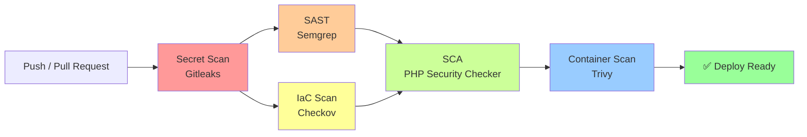
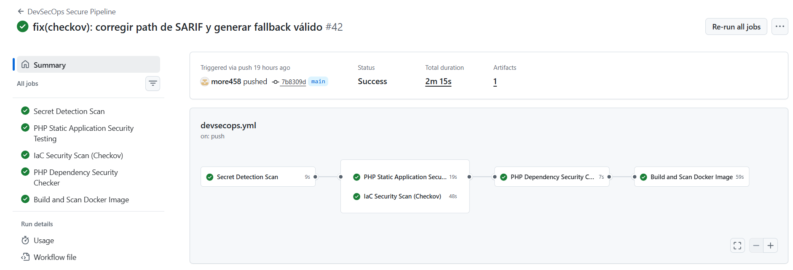
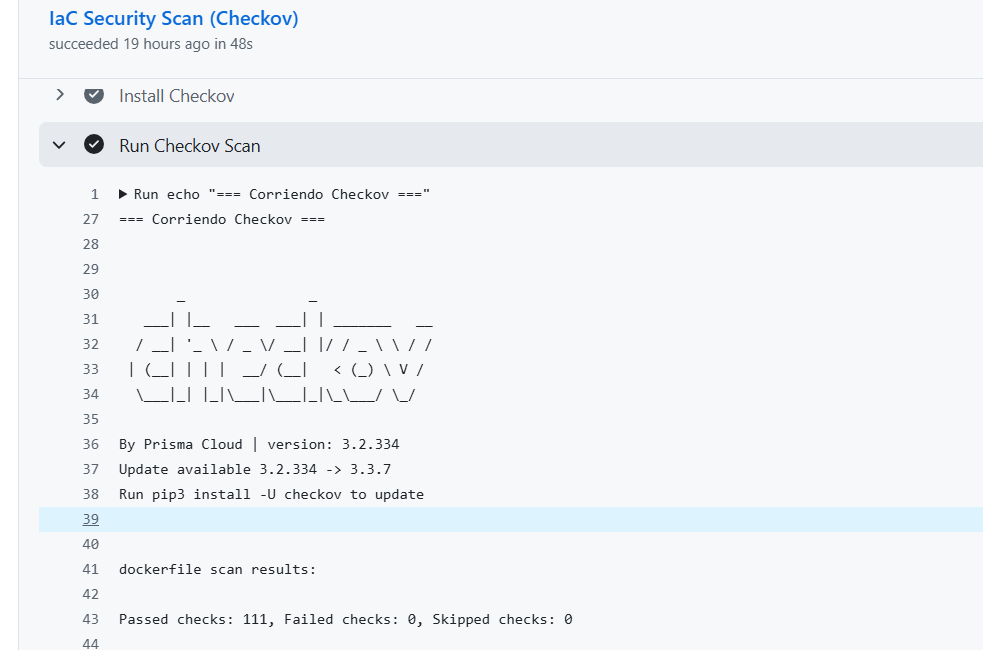

# SweetVibes DevSecOps Pipeline

> **🌐 Languages:** [Español](README.md) · **English**

End-to-end DevSecOps pipeline applied to a containerized PHP + CodeIgniter 4 application, featuring five automated security analysis layers in GitHub Actions.


---

## 🎯 About the project

This repository documents the implementation of a **complete DevSecOps pipeline** applied to a pre-existing web application (SweetVibes, an e-commerce for confectionery built with CodeIgniter 4). The focus of the project **is not the e-commerce itself**, but rather the construction, iteration, and hardening of the security pipeline that protects it.

The goal was to design a hands-on shift-left security experience by applying real principles of the discipline: static code analysis, dependency scanning, secret detection, container hardening, and infrastructure-as-code analysis, all integrated into a reproducible CI/CD flow.

**Motivation:** learn DevSecOps in an applied manner using a real project as a testing ground, rather than isolated exercises. The e-commerce served solely as a foundation upon which to build a professional defensive pipeline.

---

## 🏗️ Pipeline architecture



The pipeline applies the **shift-left security** principle: the fastest and cheapest analyses run first, and the most expensive (build + image scan) run at the end. Static analyses (SAST + IaC) run in parallel to optimize total pipeline time.

---

## 🛡️ Security tooling

| Layer | Tool | What it scans | Result |
|-------|------|---------------|--------|
| **Secrets** | [Gitleaks](https://github.com/gitleaks/gitleaks) | Full Git history for exposed credentials, tokens, and API keys | ✅ No active findings |
| **SAST** | [Semgrep](https://semgrep.dev/) | PHP code for vulnerable patterns (SQL injection, XSS, unsafe API usage) | ✅ 0 findings after excluding CI4 core |
| **IaC** | [Checkov](https://www.checkov.io/) | Dockerfile, GitHub Actions workflows, and config secret detection | ✅ **203 checks passed, 0 findings** |
| **SCA** | [local-php-security-checker](https://github.com/fabpot/local-php-security-checker) | `composer.lock` filtered to include only production dependencies | ⚠️ 1 known CVE in PHPUnit (dev-only, accepted) |
| **Container** | [Trivy](https://github.com/aquasecurity/trivy) | Built Docker image (OS, system libraries, and PHP dependencies) | ✅ No critical vulnerabilities |

---

## 🧱 Tech stack

**Application**
- PHP 8.1 (upgrade to 8.2+ pending — acknowledged as technical debt)
- CodeIgniter 4
- Composer 2.7
- MySQL 8.0

**Infrastructure**
- Docker (multi-stage build with Alpine)
- Docker Compose
- Nginx (as reverse proxy inside the container)
- PHP-FPM

**CI/CD and security**
- GitHub Actions
- SARIF reporting integrated with GitHub Security tab
- All actions pinned to commit SHA (supply-chain attack mitigation)
- Parallel execution of static analyses

**Cloud (future phase)**
- Terraform + LocalStack (for local development)
- AWS Free Tier (for final demo)
- AWS Secrets Manager (for credential management)

---

## 📁 Repository structure

```
security_project_DevSecOps/
├── .github/
│   └── workflows/
│       └── devsecops.yml          # Main pipeline (5 jobs)
├── app/                            # Application code (CI4)
├── public/                         # Static assets and entry point
├── system/                         # CodeIgniter 4 core (excluded from scans)
├── writable/                       # Cache, logs, and sessions (excluded from scans)
├── .checkov.yaml                   # Checkov configuration
├── .dockerignore                   # Exclusions for Docker build
├── .env.example                    # Configuration template (no secrets)
├── .gitignore                      # Ignores .env, vendor/, node_modules/, etc.
├── .semgrepignore                  # Semgrep exclusions (system/)
├── docker-compose.yml              # Local orchestration (no hardcoded credentials)
├── Dockerfile                      # Multi-stage: composer → builder → production
├── nginx.conf                      # Nginx config (port 8080, non-root)
└── README.md                       # This file (Spanish version)
```

---

## ⚙️ Local setup

### Prerequisites

- Docker Desktop 20+
- Git

### Installation

```bash
# 1. Clone the repository
git clone https://github.com/more458/security_project_DevSecOps.git
cd security_project_DevSecOps

# 2. Copy the configuration template and fill in the secrets
cp .env.example .env
# Edit .env and replace all CHANGEME_* with your own values

# 3. Generate the CodeIgniter encryption key
docker compose run --rm ecommerce php spark key:generate --show
# Copy the generated key into .env under encryption.key and APP_ENCRYPTION_KEY

# 4. Start the containers
docker compose up -d --build

# 5. Verify that the app responds
# Open http://localhost:8080 in your browser
```

### Required environment variables

| Variable | Description | Example |
|----------|-------------|---------|
| `MYSQL_ROOT_PASSWORD` | MySQL root user password (internal admin only) | strong password, ≥16 characters |
| `MYSQL_DATABASE` | Database name | `mi_ecomerce` |
| `MYSQL_USER` | Application user (**not root**) | `ecommerce_app` |
| `MYSQL_PASSWORD` | Application user password | strong password, different from root |
| `APP_ENCRYPTION_KEY` | Encryption key for sessions and signed cookies | Generate with `php spark key:generate` |

---

## 🔍 CI/CD pipeline in detail

The pipeline runs on **push to `main`/`develop`** and on **pull requests to `main`**. It consists of five jobs with explicit dependencies.

### Job 1 — Secret Detection (Gitleaks)

Scans the full Git history (`fetch-depth: 0`) for secrets leaked in past commits. It runs first because an exposed secret invalidates any subsequent work.

### Job 2 — Static Application Security Testing (Semgrep)

Static analysis of PHP code using community rules. The `system/` directory (CI4 core) is excluded to avoid noise from false positives in code not owned by the project. Runs in parallel with Checkov.

### Job 3 — Infrastructure as Code Scan (Checkov)

Scans the Dockerfile and GitHub Actions workflows against ~200 infrastructure security checks. Uploads results in SARIF format to GitHub's **Security** tab for historical tracking. Runs in parallel with Semgrep.

**Current result:** 203 checks passed, 0 findings. This result is a direct consequence of the hardening applied to the Dockerfile and pipeline configuration.

### Job 4 — Software Composition Analysis (PHP Security Checker)

Analyzes `composer.lock` for dependencies with known CVEs. Before scanning, the file is filtered with `jq` to remove `packages-dev`, scanning only dependencies that reach production:

```bash
jq 'del(."packages-dev")' composer.lock > prod-scan/composer.lock
```

This decision responds to the fact that `composer install --no-dev` does not modify the `composer.lock`, so a direct scan would detect CVEs in libraries that never reach the final container.

### Job 5 — Container Scan (Trivy)

Builds the Docker image locally and scans it with Trivy for:
- CVEs in OS packages (Alpine base image)
- CVEs in compiled libraries
- CVEs in final PHP dependencies

**Design note:** Trivy is installed by directly downloading the binary with SHA-256 checksum verification, instead of using the official `aquasecurity/trivy-action`. This responds to incompatibilities detected between the action and runners updated to Node 24 at the time the pipeline was built. Manual installation is more robust and more transparent:

```bash
curl -sSL -o trivy.tar.gz "https://github.com/aquasecurity/trivy/releases/..."
sha256sum -c trivy_checksums.txt
tar -xzf trivy.tar.gz
```

---

## 🔒 Hardening applied

The project went through an iterative hardening process documented across the commit history. Main changes:

### Container

- **Multi-stage build:** separation into `composer` (dependency management), `builder` (PHP extension compilation), and final production stages. The resulting image contains no Composer, no dev tools, no `.env`, and no tests.
- **Non-root user:** the container runs as `appuser` (UID 1001), not as root. Nginx listens on port 8080 (compatible with unprivileged users).
- **Integrated healthcheck:** the container reports its status, allowing orchestrators (Docker Compose, ECS, K8s) to restart it if it degrades.
- **Strict `.dockerignore`:** excludes `.env`, `.git/`, `node_modules/`, tests, documentation, and CI4 cache. None of these files travel to the final image.
- **`apk upgrade --no-cache`:** automatic patching of OS vulnerabilities on every build.

### Application

- **Zero credentials in code:** all database credentials and encryption keys are read exclusively from environment variables.
- **`.env` outside version control:** validated in both `.gitignore` and `.dockerignore`.
- **Dynamic `baseURL`:** removed the hardcoded path in `app/Config/App.php` (`http://localhost/proyecto_ecomerce`), replaced by reading `app.baseURL` from the environment.
- **Defensive defaults in `Database.php`:** fallback values were left empty, forcing early failure if environment variables fail to load (prevents silent connections to `root@localhost` without password).

### Database

- **Non-root application user:** MySQL runs with `MYSQL_USER=ecommerce_app` with permissions limited to the project database. The MySQL `root` user is reserved solely for internal administrative tasks of the container.
- **Rotated passwords:** all credentials present in the early Git history were rotated before making the repository public.
- **Integrated healthcheck:** the app waits for MySQL to be ready before attempting to connect (`depends_on: condition: service_healthy`).

### Pipeline

- **SHA-pinned actions:** all GitHub Actions referenced by commit hash instead of semantic tag, mitigating supply-chain attacks where an attacker retags a malicious version.
- **Minimal permissions:** each job declares only the permissions it needs (`contents: read`, `security-events: write` only where SARIF is uploaded).
- **SARIF upload:** Checkov findings are published to the repository's Security tab for tracking and triage.

---

## 🧠 Notable technical decisions

### Using `jq` to filter `composer.lock`

`composer install --no-dev` only installs production dependencies, but **does not modify the `composer.lock`**. Without additional filtering, the SCA scan would report CVEs in libraries (such as PHPUnit) that never reach the container. Using `jq` to remove `packages-dev` before scanning produces a report aligned with what is actually deployed.

### Parallel execution of SAST + IaC

Semgrep and Checkov are independent analyses that share no dependencies. Instead of chaining them sequentially, the pipeline runs them in parallel, reducing total time. SCA is declared with `needs: [sast-scan, iac-scan]` to wait for both.

### Manual Trivy installation

The `aquasecurity/trivy-action` presented incompatibilities with runners updated to Node 24 during pipeline construction. Manual binary installation with checksum verification is:

- More reproducible: the version is fixed and explicit.
- More transparent: no intermediate abstraction.
- More resilient: does not depend on behavior changes in an external action.

### Checkov as unified scanning

Checkov was chosen over tfsec because it covers multiple frameworks (Dockerfile, workflows, secrets, and Terraform in the future) with a single tool, simplifying pipeline maintenance. Additionally, tfsec was absorbed by Trivy in 2023, so its independent use lost meaning.

---

## 🐛 Acknowledged technical debt

These decisions are explicitly documented rather than hidden:

- **PHP 8.1 is EOL.** Upgrade to 8.2+ is pending. It was kept for stability of the original app.
- **CVE-2026-24765 in PHPUnit.** The finding is accepted because PHPUnit is a dev-only dependency and does not reach the production container. Documented in `.semgrepignore` and in the SCA filter.
- **`read_only: true` was removed from MySQL.** It causes conflicts with MySQL writing to directories not covered by `tmpfs`. Stability is prioritized; in production it is replaced by network-level and IAM controls.
- **Git history contains old credentials.** The password `secreto123` appears in early commits. It was rotated before making the repository public, but it was decided not to rewrite the history (`git filter-repo`) to preserve traceability of the learning process. Documenting the incident is more honest than hiding it.

---

## 🚀 Roadmap

**Completed phase** ✅
- DevSecOps pipeline with 5 analysis layers
- Container and application hardening
- Credential rotation
- Integrated SARIF reporting

**In-progress phase** 🚧
- **Infrastructure as code with Terraform**
- **LocalStack** for cost-free local development
- **AWS Free Tier** for final demo
- **AWS Secrets Manager** for credential management in production
- Expanding Checkov to cover `.tf` files

**Near future** 📋
- PHP upgrade to 8.2+
- Re-enabling Dependabot with adjusted configuration
- Image signing with Cosign
- SBOM (Software Bill of Materials) generated on each release

---

## 📸 Visual evidence

### Successful pipeline run

The five jobs running in parallel where appropriate, with a total time of **2m 15s**:



### Checkov results

Full IaC scan with no findings: **111 checks passed on the Dockerfile, 0 failed**.



---

## 👤 Author

**more458** ([tomimore521@gmail.com](mailto:tomimore521@gmail.com))

Project developed as part of self-directed DevSecOps learning, aimed at building a professional portfolio in the field.

---

## 📄 License

This project is distributed under the MIT license. See [LICENSE](LICENSE) for more details.

---

## 🙏 Acknowledgments

- The base application (SweetVibes e-commerce) was originally developed for a previous academic context.
- The present DevSecOps project was built on top of that base for self-directed learning purposes in the areas of application security and CI/CD automation.
