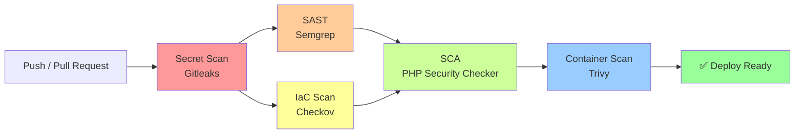
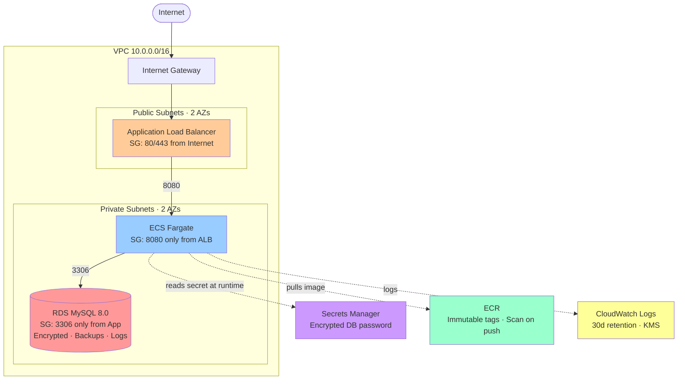
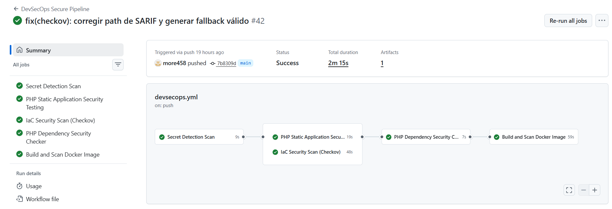
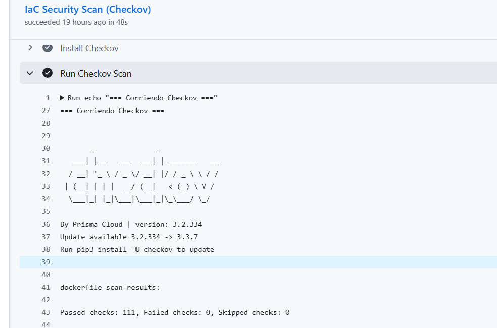

# SweetVibes DevSecOps Pipeline

> **🌐 Languages:** [Español](README.md) · **English**

End-to-end DevSecOps pipeline applied to a containerized PHP + CodeIgniter 4 application, featuring five automated security analysis layers in GitHub Actions and cloud infrastructure defined as code with Terraform.


---

## 🎯 About the project

This repository documents the implementation of a **complete DevSecOps pipeline** and **secure cloud infrastructure** applied to a pre-existing web application (SweetVibes, an e-commerce for confectionery built with CodeIgniter 4). The focus of the project **is not the e-commerce itself**, but rather the construction, iteration, and hardening of the security pipeline and the infrastructure that deploys it.

The goal was to design a hands-on shift-left security experience by applying real principles of the discipline: static code analysis, dependency scanning, secret detection, container hardening, infrastructure-as-code analysis, and secure cloud deployment with secrets management, all integrated into a reproducible CI/CD flow.

**Motivation:** learn DevSecOps in an applied manner using a real project as a testing ground, rather than isolated exercises. The e-commerce served solely as a foundation upon which to build a professional defensive pipeline and its cloud infrastructure.

---

## 🏗️ Pipeline architecture


```mermaid
flowchart LR
    A[Push / Pull Request] --> B[Secret Scan<br/>Gitleaks]
    B --> C[SAST<br/>Semgrep]
    B --> D[IaC Scan<br/>Checkov]
    C --> E[SCA<br/>PHP Security Checker]
    D --> E
    E --> F[Container Scan<br/>Trivy]
    F --> G[✅ Deploy Ready]

    style B fill:#ff9999
    style C fill:#ffcc99
    style D fill:#ffff99
    style E fill:#ccff99
    style F fill:#99ccff
    style G fill:#99ff99
```

The pipeline applies the **shift-left security** principle: the fastest and cheapest analyses run first, and the most expensive (build + image scan) run at the end. Static analyses (SAST + IaC) run in parallel to optimize total pipeline time. Checkov covers the Dockerfile and workflows as well as the infrastructure's Terraform code.

---

## ☁️ Infrastructure architecture (Cloud)

The AWS infrastructure is fully defined as code with Terraform and validated locally against [Floci](https://floci.io/) (an open-source AWS emulator, a replacement for LocalStack after its Community edition license change in March 2026). The design follows the industry-standard pattern: public/private layer separation, least-privilege security group chaining, and runtime secrets management.


```mermaid
flowchart TB
    Internet([Internet]) --> IGW[Internet Gateway]

    subgraph VPC["VPC 10.0.0.0/16"]
        IGW --> ALB

        subgraph Public["Public Subnets · 2 AZs"]
            ALB[Application Load Balancer<br/>SG: 80/443 from Internet]
        end

        subgraph Private["Private Subnets · 2 AZs"]
            ECS[ECS Fargate<br/>SG: 8080 only from ALB]
            RDS[(RDS MySQL 8.0<br/>SG: 3306 only from App<br/>Encrypted · Backups · Logs)]
        end

        ALB -->|8080| ECS
        ECS -->|3306| RDS
    end

    ECS -.->|reads secret at runtime| SM[Secrets Manager<br/>Encrypted DB password]
    ECS -.->|pulls image| ECR[ECR<br/>Immutable tags · Scan on push]
    ECS -.->|logs| CW[CloudWatch Logs<br/>30d retention · KMS]

    style ALB fill:#ffcc99
    style ECS fill:#99ccff
    style RDS fill:#ff9999
    style SM fill:#cc99ff
    style ECR fill:#99ffcc
    style CW fill:#ffff99
```

### Infrastructure components

| Component | Description | Security controls |
|-----------|-------------|-------------------|
| **VPC + Subnets** | Isolated network `10.0.0.0/16` with 4 subnets (2 public + 2 private) across 2 Availability Zones | Public/private isolation, multi-AZ high availability |
| **Internet Gateway + Routing** | Internet egress only for public subnets | Private subnets have no route to internet (isolated) |
| **Security Groups** | 3 chained SGs: ALB → App → DB | Least-privilege; the DB only accepts the App, the App only the ALB |
| **RDS MySQL 8.0** | Managed database in private subnets | Encryption at rest, 7-day backups, CloudWatch logs, no public access |
| **ECR** | Private Docker image registry | Immutable tags, scan on push, AES256 encryption |
| **ECS Fargate** | Serverless container orchestration | Runs in private subnets, non-root container, `desired_count=2` |
| **ALB** | Public load balancer, entry point | `drop_invalid_header_fields`, health checks |
| **IAM Roles** | Separate execution and task roles | Least-privilege; read permission only on the specific secret |
| **Secrets Manager** | Encrypted DB password | Runtime injection via ARN, never plaintext in code |
| **CloudWatch Logs + KMS** | Centralized encrypted logs | 30-day retention, environment-conditional KMS encryption |

---

## 🛡️ Security tooling

| Layer | Tool | What it scans | Result |
|-------|------|---------------|--------|
| **Secrets** | [Gitleaks](https://github.com/gitleaks/gitleaks) | Full Git history for exposed credentials, tokens, and API keys | ✅ No active findings |
| **SAST** | [Semgrep](https://semgrep.dev/) | PHP and Terraform code for vulnerable patterns | ✅ 0 findings after triage and excluding CI4 core |
| **IaC** | [Checkov](https://www.checkov.io/) | Dockerfile, GitHub Actions workflows, secrets, and **Terraform** | ✅ **49 checks passed, 0 findings, 21 suppressed with justification** |
| **SCA** | [local-php-security-checker](https://github.com/fabpot/local-php-security-checker) | `composer.lock` filtered to include only production dependencies | ⚠️ 1 known CVE in PHPUnit (dev-only, accepted) |
| **Container** | [Trivy](https://github.com/aquasecurity/trivy) | Built Docker image (OS, system libraries, and PHP dependencies) | ✅ No critical vulnerabilities |

---

## 🧱 Tech stack

**Application**
- PHP 8.1 (upgrade to 8.2+ pending — acknowledged as technical debt)
- CodeIgniter 4
- Composer 2.7
- MySQL 8.0

**Infrastructure**
- Docker (multi-stage build with Alpine)
- Docker Compose
- Nginx (as reverse proxy inside the container)
- PHP-FPM

**Cloud and Infrastructure as Code**
- Terraform (declarative definition of the entire AWS infrastructure)
- Floci (local AWS emulator, LocalStack replacement)
- AWS CLI
- AWS services: VPC, RDS, ECR, ECS Fargate, ALB, IAM, Secrets Manager, CloudWatch, KMS

**CI/CD and security**
- GitHub Actions
- SARIF reporting integrated with GitHub Security tab
- All actions pinned to commit SHA (supply-chain attack mitigation)
- Parallel execution of static analyses

---

## 📁 Repository structure

```
security_project_DevSecOps/
├── .github/
│   └── workflows/
│       └── devsecops.yml          # Main pipeline (5 jobs)
├── app/                            # Application code (CI4)
├── public/                         # Static assets and entry point
├── system/                         # CodeIgniter 4 core (excluded from scans)
├── writable/                       # Cache, logs, and sessions (excluded from scans)
├── terraform/                      # Infrastructure as code
│   ├── providers.tf                # AWS provider pointing to Floci
│   ├── variables.tf                # Configurable variables
│   ├── main.tf                     # Resources (VPC, RDS, ECS, ALB, Secrets, etc.)
│   ├── outputs.tf                  # Values exposed after deployment
│   └── .gitignore                  # Ignores tfstate and .terraform/
├── .checkov.yaml                   # Checkov configuration + justified suppressions
├── .dockerignore                   # Exclusions for Docker build
├── .env.example                    # Configuration template (no secrets)
├── .gitignore                      # Ignores .env, vendor/, node_modules/, etc.
├── .semgrepignore                  # Semgrep exclusions (system/)
├── docker-compose.yml              # Local orchestration (no hardcoded credentials)
├── Dockerfile                      # Multi-stage: composer → builder → production
├── nginx.conf                      # Nginx config (port 8080, non-root)
└── README.md                       # Spanish version
```

---

## ⚙️ Local setup

### Prerequisites

- Docker Desktop 20+
- Git
- Terraform CLI (for the infrastructure phase)
- AWS CLI (to interact with Floci)

### Application installation

```bash
# 1. Clone the repository
git clone https://github.com/more458/security_project_DevSecOps.git
cd security_project_DevSecOps

# 2. Copy the configuration template and fill in the secrets
cp .env.example .env
# Edit .env and replace all CHANGEME_* with your own values

# 3. Generate the CodeIgniter encryption key
docker compose run --rm ecommerce php spark key:generate --show
# Copy the generated key into .env under encryption.key and APP_ENCRYPTION_KEY

# 4. Start the containers
docker compose up -d --build

# 5. Verify that the app responds
# Open http://localhost:8080 in your browser
```

### Infrastructure deployment (Floci)

```bash
# 1. Start the AWS emulator
docker compose up -d floci

# 2. Configure dummy credentials for the AWS CLI
export AWS_ACCESS_KEY_ID=test
export AWS_SECRET_ACCESS_KEY=test
export AWS_DEFAULT_REGION=us-east-1
export AWS_ENDPOINT_URL=http://localhost:4566

# 3. Initialize and apply Terraform
cd terraform
terraform init
terraform apply   # Requires db_password via terraform.tfvars (not versioned)
```

---

## 🔍 CI/CD pipeline in detail

The pipeline runs on **push to `main`/`develop`** and on **pull requests to `main`**. It consists of five jobs with explicit dependencies.

### Job 1 — Secret Detection (Gitleaks)

Scans the full Git history (`fetch-depth: 0`) for secrets leaked in past commits. It runs first because an exposed secret invalidates any subsequent work.

### Job 2 — Static Application Security Testing (Semgrep)

Static analysis of PHP and Terraform code using community rules. The `system/` directory (CI4 core) is excluded to avoid noise from false positives in code not owned by the project. Runs in parallel with Checkov.

### Job 3 — Infrastructure as Code Scan (Checkov)

Scans the Dockerfile, GitHub Actions workflows, and **Terraform code** against Checkov's infrastructure security checks. Uploads results in SARIF format to GitHub's **Security** tab for historical tracking. Runs in parallel with Semgrep.

**Terraform result:** 49 checks passed, 0 failed, 21 suppressed with documented justification. The triage process —fixing findings with real value and documenting why the rest are accepted— is the core of DevSecOps work.

### Job 4 — Software Composition Analysis (PHP Security Checker)

Analyzes `composer.lock` for dependencies with known CVEs. Before scanning, the file is filtered with `jq` to remove `packages-dev`, scanning only dependencies that reach production:

```bash
jq 'del(."packages-dev")' composer.lock > prod-scan/composer.lock
```

This decision responds to the fact that `composer install --no-dev` does not modify the `composer.lock`, so a direct scan would detect CVEs in libraries that never reach the final container.

### Job 5 — Container Scan (Trivy)

Builds the Docker image locally and scans it with Trivy for:
- CVEs in OS packages (Alpine base image)
- CVEs in compiled libraries
- CVEs in final PHP dependencies

**Design note:** Trivy is installed by directly downloading the binary with SHA-256 checksum verification, instead of using the official `aquasecurity/trivy-action`. This responds to incompatibilities detected between the action and runners updated to Node 24 at the time the pipeline was built. Manual installation is more robust and more transparent.

---

## 🔒 Hardening applied

The project went through an iterative hardening process documented across the commit history.

### Container

- **Multi-stage build:** `composer`, `builder`, and final production stages. The resulting image contains no Composer, no dev tools, no `.env`, and no tests.
- **Non-root user:** the container runs as `appuser` (UID 1001). Nginx listens on port 8080 (compatible with unprivileged users).
- **Integrated healthcheck** and **strict `.dockerignore`** excluding secrets and dev clutter.
- **`apk upgrade --no-cache`:** automatic OS vulnerability patching on every build.

### Application

- **Zero credentials in code:** all credentials are read from environment variables.
- **`.env` outside version control** (validated in `.gitignore` and `.dockerignore`).
- **Dynamic `baseURL`** and **defensive defaults in `Database.php`** (early failure instead of insecure connections).

### Database

- **Non-root application user** (`ecommerce_app`) with permissions limited to the project DB.
- **Rotated passwords** before making the repository public.
- **Healthcheck** that makes the app wait until MySQL is ready.

### Infrastructure (Cloud)

- **Security group chaining (least-privilege):** the ALB accepts internet, the App only accepts the ALB, the DB only accepts the App. No internal service is exposed to the internet.
- **Database in private subnet:** no route to internet, encrypted at rest, with automatic backups and CloudWatch logs.
- **Runtime secrets management:** the DB password lives encrypted in Secrets Manager and is injected into the container at startup, referenced by ARN. It never appears in the code or the task definition.
- **IAM with least-privilege:** separate execution and task roles; read permission scoped exclusively to the required secret.
- **Hardened ECR:** immutable tags (prevents malicious overwrite), scan on push, and encryption at rest.
- **KMS encryption of logs and secrets** with automatic key rotation (enabled per environment).

### Pipeline

- **SHA-pinned actions** (supply-chain mitigation).
- **Minimal permissions** per job.
- **SARIF upload** to the repository's Security tab.

---

## 🧠 Notable technical decisions

### Security group chaining by identity, not by IP

Instead of restricting DB access by IP range, the security group rules reference **other security groups** (`source_security_group_id`). The DB only accepts traffic from resources that have the application's SG. This is more secure (does not depend on changing IPs) and self-documenting: the rule directly expresses "only the app talks to the DB".

### Environment-conditional KMS encryption

Encryption with custom KMS keys, required to pass static analysis, is not supported by the local emulator (Floci does not implement `AssociateKmsKey`). It was resolved with a conditional variable (`use_kms_encryption`) that enables KMS in real AWS and omits it in the emulation environment, keeping the code secure by design without breaking the local development flow.

### Secrets management aligned from the design

From the first phase, the application was designed to read all its credentials from environment variables. This allowed, at the end, injecting the password from Secrets Manager at runtime **without modifying a single line of the application code**. Each phase prepared the next.

### IaC finding triage

Checkov detected 26 findings in the Terraform. Those that provided real value at reasonable effort were fixed (auto minor upgrades, conditional Multi-AZ, copy tags to snapshot, closing the default security group), and the rest were suppressed **centrally and documented** in `.checkov.yaml`, classifying each by its reason: conscious development technical debt, emulator limitation, or external infrastructure out of scope.

---

## 📚 Lessons learned (working with AWS emulators)

Developing against a local emulator revealed real differences between the development environment and production AWS — a core learning for working with IaC:

- **Emulators do not guarantee persistence between restarts.** When restarting Floci, the infrastructure had to be recreated. This reinforces the value of Infrastructure as Code: the entire infra rebuilds from scratch with a single command.
- **Cross-referencing security group rules** (as separate resources) failed in the emulator; they were resolved by defining them inline. The original code was correct for real AWS — the difference was emulator fidelity.
- **Some attributes are immutable** (such as ECR encryption): changing them requires recreating the resource, which the emulator does not always support.
- **A successful `apply` against an emulator does not guarantee the same result against real AWS**, nor vice versa. Final validation requires testing against the real cloud (planned with AWS Free Tier).

---

## 🐛 Acknowledged technical debt

These decisions are explicitly documented rather than hidden:

- **PHP 8.1 is EOL.** Upgrade to 8.2+ is pending. It was kept for stability of the original app.
- **CVE in PHPUnit.** The finding is accepted because PHPUnit is a dev-only dependency and does not reach the production container.
- **`read_only: true` was removed from MySQL** due to conflicts with the engine's writes; it is replaced by network and IAM controls.
- **Git history contains old credentials** (`secreto123`). They were rotated before making the repository public; the history was intentionally not rewritten to preserve traceability of the learning process.
- **IaC findings suppressed with justification:** HTTPS/TLS (requires certificate and real domain), ALB access logs and VPC flow logs (require dedicated buckets/log groups), deletion protection (disabled to allow `terraform destroy` in dev). All documented in `.checkov.yaml`, enabled in production.

---

## 🚀 Roadmap

**Completed phases** ✅
- DevSecOps pipeline with 5 analysis layers
- Container and application hardening
- Credential rotation
- Integrated SARIF reporting
- **Complete infrastructure as code with Terraform** (VPC, RDS, ECS Fargate, ALB, IAM, Secrets Manager)
- **Runtime secrets management with AWS Secrets Manager**
- **IaC (Terraform) scanning integrated into the pipeline with Checkov**

**Near future** 📋
- Validating the infrastructure against real AWS Free Tier (to verify IAM policies and non-emulated features)
- PHP upgrade to 8.2+
- Re-enabling Dependabot with adjusted configuration
- Image signing with Cosign
- SBOM (Software Bill of Materials) generated on each release
- Production hardening: HTTPS with ACM certificate, WAF, VPC flow logs, restricted egress

**Related future project** 🔭
- A dedicated Kubernetes project (cluster hardening, network policies, admission controllers), planned as a thematic continuation with a different focus.

---

## 📸 Visual evidence

### Successful pipeline run

The five jobs running in parallel where appropriate:



### Checkov results

Full IaC scan with no findings:



---

## 👤 Author

**more458** ([tomimore521@gmail.com](mailto:tomimore521@gmail.com))

Project developed as part of self-directed DevSecOps learning, aimed at building a professional portfolio in the field.

---

## 📄 License

This project is distributed under the MIT license. See [LICENSE](LICENSE) for more details.

---

## 🙏 Acknowledgments

- The base application (SweetVibes e-commerce) was originally developed for a previous academic context.
- The present DevSecOps project was built on top of that base for self-directed learning purposes in the areas of application security, CI/CD automation, and cloud infrastructure.