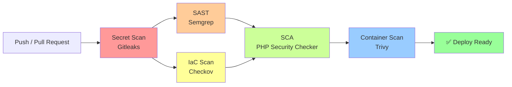

# SweetVibes DevSecOps Pipeline

> **🌐 Idiomas:** **Español** · [English](README.en.md)

Pipeline DevSecOps de extremo a extremo aplicado sobre una aplicación PHP + CodeIgniter 4 containerizada, con cinco capas de análisis de seguridad automatizadas en GitHub Actions.


---

## 🎯 Sobre el proyecto

Este repositorio documenta la implementación de un **pipeline DevSecOps completo** sobre una aplicación web previamente existente (SweetVibes, un e-commerce de dulces desarrollado en CodeIgniter 4). El foco del proyecto **no es el e-commerce en sí**, sino la construcción, iteración y endurecimiento del pipeline de seguridad que lo protege.

El objetivo fue diseñar una experiencia práctica de shift-left security aplicando principios reales de la disciplina: análisis estático de código, escaneo de dependencias, detección de secretos, hardening de contenedores y análisis de infraestructura como código, todo integrado en un flujo de CI/CD reproducible.

**Motivación:** aprender DevSecOps de manera aplicada usando un proyecto real como campo de pruebas, en lugar de ejercicios aislados. El e-commerce sirvió únicamente como base sobre la cual construir un pipeline defensivo profesional.

---

## 🏗️ Arquitectura del pipeline



El pipeline aplica el principio de **shift-left security**: los análisis más rápidos y baratos corren primero, y los más costosos (build + scan de imagen) al final. Los análisis estáticos (SAST + IaC) corren en paralelo para optimizar tiempo total del pipeline.

---

## 🛡️ Herramientas de seguridad

| Capa | Herramienta | Qué escanea | Resultado |
|------|-------------|-------------|-----------|
| **Secretos** | [Gitleaks](https://github.com/gitleaks/gitleaks) | Historial completo de Git en busca de credenciales, tokens y claves API expuestas | ✅ Sin findings activos |
| **SAST** | [Semgrep](https://semgrep.dev/) | Código PHP en busca de patrones vulnerables (SQL injection, XSS, uso inseguro de APIs) | ✅ 0 findings tras exclusión del core de CI4 |
| **IaC** | [Checkov](https://www.checkov.io/) | Dockerfile, workflows de GitHub Actions y detección de secretos en config | ✅ **203 checks pasados, 0 findings** |
| **SCA** | [local-php-security-checker](https://github.com/fabpot/local-php-security-checker) | `composer.lock` filtrado para incluir solo dependencias de producción | ⚠️ 1 CVE conocido en PHPUnit (dev-only, aceptado) |
| **Container** | [Trivy](https://github.com/aquasecurity/trivy) | Imagen Docker construida (SO, librerías del sistema y dependencias PHP) | ✅ Sin vulnerabilidades críticas |

---

## 🧱 Stack tecnológico

**Aplicación**
- PHP 8.1 (upgrade a 8.2+ pendiente — reconocido como deuda técnica)
- CodeIgniter 4
- Composer 2.7
- MySQL 8.0

**Infraestructura**
- Docker (multi-stage build con Alpine)
- Docker Compose
- Nginx (como reverse proxy dentro del contenedor)
- PHP-FPM

**CI/CD y seguridad**
- GitHub Actions
- SARIF reporting integrado con GitHub Security tab
- Todas las actions pineadas a commit SHA (mitigación de supply-chain attacks)
- Ejecución paralela de análisis estáticos

**Cloud (fase futura)**
- Terraform + LocalStack (para desarrollo local)
- AWS Free Tier (para demo final)
- AWS Secrets Manager (para gestión de credenciales)

---

## 📁 Estructura del repositorio

```
security_project_DevSecOps/
├── .github/
│   └── workflows/
│       └── devsecops.yml          # Pipeline principal (5 jobs)
├── app/                            # Código de aplicación (CI4)
├── public/                         # Assets estáticos y entry point
├── system/                         # Core de CodeIgniter 4 (excluido de escaneos)
├── writable/                       # Cache, logs y sesiones (excluido de escaneos)
├── .checkov.yaml                   # Configuración de Checkov
├── .dockerignore                   # Exclusiones para el build de Docker
├── .env.example                    # Template de configuración (sin secretos)
├── .gitignore                      # Ignora .env, vendor/, node_modules/, etc.
├── .semgrepignore                  # Exclusiones de Semgrep (system/)
├── docker-compose.yml              # Orquestación local (sin credenciales hardcodeadas)
├── Dockerfile                      # Multi-stage: composer → builder → producción
├── nginx.conf                      # Config de Nginx (puerto 8080, non-root)
└── README.md                       # Este archivo
```

---

## ⚙️ Setup local

### Prerrequisitos

- Docker Desktop 20+
- Git

### Instalación

```bash
# 1. Clonar el repositorio
git clone https://github.com/more458/security_project_DevSecOps.git
cd security_project_DevSecOps

# 2. Copiar el template de configuración y completar los secretos
cp .env.example .env
# Editar .env y reemplazar todos los CHANGEME_* con valores propios

# 3. Generar la clave de encriptación de CodeIgniter
docker compose run --rm ecommerce php spark key:generate --show
# Copiar la clave generada al .env en encryption.key y APP_ENCRYPTION_KEY

# 4. Levantar los contenedores
docker compose up -d --build

# 5. Verificar que la app responde
# Abrir http://localhost:8080 en el navegador
```

### Variables de entorno requeridas

| Variable | Descripción | Ejemplo |
|----------|-------------|---------|
| `MYSQL_ROOT_PASSWORD` | Contraseña del usuario root de MySQL (uso administrativo interno) | contraseña fuerte, ≥16 caracteres |
| `MYSQL_DATABASE` | Nombre de la base de datos | `mi_ecomerce` |
| `MYSQL_USER` | Usuario de aplicación (**no root**) | `ecommerce_app` |
| `MYSQL_PASSWORD` | Contraseña del usuario de aplicación | contraseña fuerte, distinta de root |
| `APP_ENCRYPTION_KEY` | Clave de encriptación para sesiones y cookies firmadas | Generar con `php spark key:generate` |

---

## 🔍 Pipeline de CI/CD en detalle

El pipeline se ejecuta en **push a `main`/`develop`** y en **pull requests a `main`**. Está compuesto por cinco jobs con dependencias explícitas.

### Job 1 — Secret Detection (Gitleaks)

Escanea todo el historial de Git (`fetch-depth: 0`) en busca de secretos filtrados en commits pasados. Es el primer job porque un secreto expuesto invalida cualquier trabajo posterior.

### Job 2 — Static Application Security Testing (Semgrep)

Análisis estático del código PHP con reglas de la comunidad. Se excluye el directorio `system/` (core de CI4) para evitar ruido de falsos positivos en código no controlado por el proyecto. Corre en paralelo con Checkov.

### Job 3 — Infrastructure as Code Scan (Checkov)

Escanea el Dockerfile y los workflows de GitHub Actions contra ~200 checks de seguridad de infraestructura. Sube los resultados en formato SARIF a la pestaña **Security** de GitHub para tracking histórico. Corre en paralelo con Semgrep.

**Resultado actual:** 203 checks pasados, 0 findings. Este resultado es consecuencia directa del hardening aplicado en el Dockerfile y en la configuración del pipeline.

### Job 4 — Software Composition Analysis (PHP Security Checker)

Analiza `composer.lock` en busca de dependencias con CVEs conocidos. Antes de escanear, se filtra el archivo con `jq` para eliminar los `packages-dev`, escaneando únicamente dependencias que llegan a producción:

```bash
jq 'del(."packages-dev")' composer.lock > prod-scan/composer.lock
```

Esta decisión responde a que `composer install --no-dev` no modifica el `composer.lock`, por lo que un scan directo detectaría CVEs en librerías que nunca llegan al contenedor final.

### Job 5 — Container Scan (Trivy)

Construye la imagen de Docker localmente y la escanea con Trivy en busca de:
- CVEs en paquetes del sistema (Alpine base image)
- CVEs en librerías compiladas
- CVEs en dependencias PHP finales

**Nota de decisión:** Trivy se instala mediante descarga directa del binario con verificación de checksum SHA-256, en lugar de usar la action oficial `aquasecurity/trivy-action`. Esto responde a incompatibilidades detectadas entre la action y los runners con Node 24 al momento de construir el pipeline. La instalación manual es más robusta y más transparente:

```bash
curl -sSL -o trivy.tar.gz "https://github.com/aquasecurity/trivy/releases/..."
sha256sum -c trivy_checksums.txt
tar -xzf trivy.tar.gz
```

---

## 🔒 Hardening realizado

El proyecto pasó por un proceso iterativo de endurecimiento documentado a través del historial de commits. Los cambios principales:

### Contenedor

- **Multi-stage build:** separación en etapas de `composer` (gestión de dependencias), `builder` (compilación de extensiones PHP) y producción final. La imagen resultante no contiene Composer, ni herramientas de desarrollo, ni `.env`, ni tests.
- **Usuario no-root:** el contenedor corre como `appuser` (UID 1001), no como root. Nginx escucha en puerto 8080 (compatible con usuarios sin privilegios).
- **Healthcheck integrado:** el contenedor reporta su estado, permitiendo orquestadores (Docker Compose, ECS, K8s) reiniciarlo si degrada.
- **`.dockerignore` estricto:** excluye `.env`, `.git/`, `node_modules/`, tests, documentación y caché de CI4. Ninguno de estos archivos viaja a la imagen final.
- **`apk upgrade --no-cache`:** parcheo automático de vulnerabilidades del sistema operativo en cada build.

### Aplicación

- **Cero credenciales en código:** todas las credenciales de base de datos y claves de encriptación se leen exclusivamente desde variables de entorno.
- **`.env` fuera del control de versiones:** validado tanto en el `.gitignore` como en el `.dockerignore`.
- **`baseURL` dinámica:** eliminación del path hardcodeado en `app/Config/App.php` (`http://localhost/proyecto_ecomerce`), reemplazado por lectura de `app.baseURL` desde el entorno.
- **Defaults defensivos en `Database.php`:** los valores fallback se dejaron vacíos, forzando fallo temprano si las variables de entorno no cargan (evita conexiones silenciosas a `root@localhost` sin contraseña).

### Base de datos

- **Usuario de aplicación no-root:** MySQL corre con `MYSQL_USER=ecommerce_app` con permisos limitados a la base de datos del proyecto. El usuario `root` de MySQL se reserva únicamente para tareas administrativas internas del contenedor.
- **Contraseñas rotadas:** todas las credenciales presentes en el historial temprano de Git fueron rotadas antes de hacer el repositorio público.
- **Healthcheck integrado:** la app espera a que MySQL esté listo antes de intentar conectarse (`depends_on: condition: service_healthy`).

### Pipeline

- **Actions pineadas a SHA:** todas las actions de GitHub referenciadas por commit hash en lugar de tag semántico, mitigando ataques de supply chain donde un atacante retagea una versión maliciosa.
- **Permisos mínimos:** cada job declara solo los permisos que necesita (`contents: read`, `security-events: write` únicamente donde se sube SARIF).
- **SARIF upload:** los findings de Checkov se publican en la pestaña Security del repositorio para tracking y triage.

---

## 🧠 Decisiones técnicas destacables

### Uso de `jq` para filtrar `composer.lock`

`composer install --no-dev` instala solo dependencias de producción, pero **no modifica el `composer.lock`**. Sin filtrado adicional, el escaneo de SCA reportaría CVEs de librerías (como PHPUnit) que nunca llegan al contenedor. El uso de `jq` para eliminar `packages-dev` antes del scan produce un reporte alineado con lo que realmente se despliega.

### Ejecución paralela de SAST + IaC

Semgrep y Checkov son análisis independientes que no comparten dependencias entre sí. En lugar de encadenarlos secuencialmente, el pipeline los ejecuta en paralelo, reduciendo el tiempo total. El SCA se declara con `needs: [sast-scan, iac-scan]` para esperar a ambos.

### Trivy instalado manualmente

La action `aquasecurity/trivy-action` presentó incompatibilidades con los runners actualizados a Node 24 durante la construcción del pipeline. La instalación manual del binario con verificación de checksum es:

- Más reproducible: la versión queda fija y explícita.
- Más transparente: no hay abstracción intermedia.
- Más resiliente: no depende de cambios de comportamiento en una action externa.

### Checkov como escaneo unificado

Se eligió Checkov sobre tfsec porque cubre múltiples frameworks (Dockerfile, workflows, secretos, y en el futuro Terraform) con una sola herramienta, simplificando el mantenimiento del pipeline. Además, tfsec fue absorbido por Trivy en 2023, por lo que su uso independiente perdió sentido.

---

## 🐛 Deuda técnica reconocida

Estas decisiones se documentan explícitamente en lugar de ocultarse:

- **PHP 8.1 está EOL.** El upgrade a 8.2+ está pendiente. Se mantuvo por estabilidad de la app original.
- **CVE-2026-24765 en PHPUnit.** Se acepta el finding porque PHPUnit es una dependencia dev-only y no llega al contenedor de producción. Documentado en `.semgrepignore` y en el filtro de SCA.
- **`read_only: true` en MySQL fue removido.** Genera conflictos con la escritura de MySQL en directorios no cubiertos por `tmpfs`. Se prioriza estabilidad; en producción se sustituye por controles de nivel de red y de IAM.
- **Historial de Git contiene credenciales antiguas.** La contraseña `secreto123` aparece en commits tempranos. Fue rotada antes de hacer público el repositorio, pero se decidió no reescribir el historial (`git filter-repo`) para preservar la trazabilidad del proceso de aprendizaje. Documentar el incidente es más honesto que ocultarlo.

---

## 🚀 Roadmap

**Fase completada** ✅
- Pipeline DevSecOps con 5 capas de análisis
- Hardening de contenedor y aplicación
- Rotación de credenciales
- SARIF reporting integrado

**Fase en curso** 🚧
- **Infraestructura como código con Terraform**
- **LocalStack** para desarrollo local sin costo
- **AWS Free Tier** para demo final
- **AWS Secrets Manager** para gestión de credenciales en producción
- Ampliación de Checkov para cubrir archivos `.tf`

**Futuro cercano** 📋
- Upgrade de PHP a 8.2+
- Re-activación de Dependabot con configuración ajustada
- Firmado de imágenes con Cosign
- SBOM (Software Bill of Materials) generado en cada release

---

## 📸 Evidencia visual

### Pipeline en ejecución exitosa

Los cinco jobs corriendo en paralelo donde corresponde, con tiempo total de **2m 15s**:


### Resultados de Checkov

El escaneo de IaC completo sin findings: **111 checks pasados en el Dockerfile, 0 fallados**.


---

## 👤 Autor

**more458** ([tomimore521@gmail.com](mailto:tomimore521@gmail.com))

Proyecto desarrollado como parte de un aprendizaje autodirigido en DevSecOps, orientado a construir un portfolio profesional en el área.

---

## 📄 Licencia

Este proyecto se distribuye bajo la licencia MIT. Ver [LICENSE](LICENSE) para más detalles.

---

## 🙏 Reconocimientos

- La aplicación base (SweetVibes e-commerce) fue originalmente desarrollada para un contexto académico previo.
- El presente proyecto DevSecOps se construyó sobre esa base con fines de aprendizaje autodirigido en el área de seguridad de aplicaciones y automatización de CI/CD.
