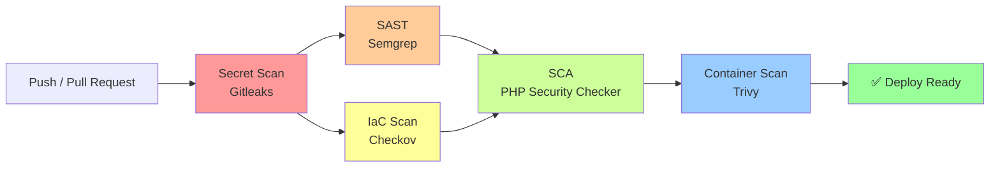
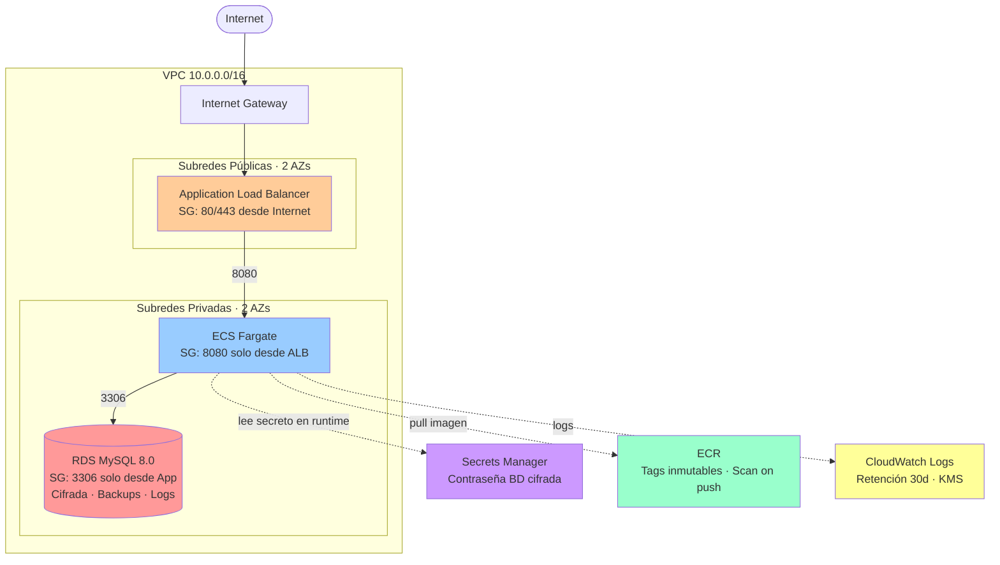

# SweetVibes DevSecOps Pipeline

> **🌐 Idiomas:** **Español** · [English](README.en.md)

Pipeline DevSecOps de extremo a extremo aplicado sobre una aplicación PHP + CodeIgniter 4 containerizada, con cinco capas de análisis de seguridad automatizadas en GitHub Actions e infraestructura cloud definida como código con Terraform.


---

## 🎯 Sobre el proyecto

Este repositorio documenta la implementación de un **pipeline DevSecOps completo** y una **infraestructura cloud segura** sobre una aplicación web previamente existente (SweetVibes, un e-commerce de dulces desarrollado en CodeIgniter 4). El foco del proyecto **no es el e-commerce en sí**, sino la construcción, iteración y endurecimiento del pipeline de seguridad y la infraestructura que lo despliega.

El objetivo fue diseñar una experiencia práctica de shift-left security aplicando principios reales de la disciplina: análisis estático de código, escaneo de dependencias, detección de secretos, hardening de contenedores, análisis de infraestructura como código, y despliegue seguro en la nube con gestión de secretos, todo integrado en un flujo de CI/CD reproducible.

**Motivación:** aprender DevSecOps de manera aplicada usando un proyecto real como campo de pruebas, en lugar de ejercicios aislados. El e-commerce sirvió únicamente como base sobre la cual construir un pipeline defensivo profesional y su infraestructura cloud.

---

## 🏗️ Arquitectura del pipeline


```mermaid
flowchart LR
    A[Push / Pull Request] --> B[Secret Scan<br/>Gitleaks]
    B --> C[SAST<br/>Semgrep]
    B --> D[IaC Scan<br/>Checkov]
    C --> E[SCA<br/>PHP Security Checker]
    D --> E
    E --> F[Container Scan<br/>Trivy]
    F --> G[✅ Deploy Ready]

    style B fill:#ff9999
    style C fill:#ffcc99
    style D fill:#ffff99
    style E fill:#ccff99
    style F fill:#99ccff
    style G fill:#99ff99
```

El pipeline aplica el principio de **shift-left security**: los análisis más rápidos y baratos corren primero, y los más costosos (build + scan de imagen) al final. Los análisis estáticos (SAST + IaC) corren en paralelo para optimizar tiempo total del pipeline. Checkov cubre tanto el Dockerfile y los workflows como el código Terraform de la infraestructura.

---

## ☁️ Arquitectura de infraestructura (Cloud)

La infraestructura AWS está definida completamente como código con Terraform y validada localmente contra [Floci](https://floci.io/) (emulador de AWS de código abierto, reemplazo de LocalStack tras el cambio de licencia de su edición Community en marzo de 2026). El diseño sigue el patrón estándar de la industria: separación de capas público/privada, encadenamiento de security groups con least-privilege, y gestión de secretos en runtime.


```mermaid
flowchart TB
    Internet([Internet]) --> IGW[Internet Gateway]

    subgraph VPC["VPC 10.0.0.0/16"]
        IGW --> ALB

        subgraph Public["Subredes Públicas · 2 AZs"]
            ALB[Application Load Balancer<br/>SG: 80/443 desde Internet]
        end

        subgraph Private["Subredes Privadas · 2 AZs"]
            ECS[ECS Fargate<br/>SG: 8080 solo desde ALB]
            RDS[(RDS MySQL 8.0<br/>SG: 3306 solo desde App<br/>Cifrada · Backups · Logs)]
        end

        ALB -->|8080| ECS
        ECS -->|3306| RDS
    end

    ECS -.->|lee secreto en runtime| SM[Secrets Manager<br/>Contraseña BD cifrada]
    ECS -.->|pull imagen| ECR[ECR<br/>Tags inmutables · Scan on push]
    ECS -.->|logs| CW[CloudWatch Logs<br/>Retención 30d · KMS]

    style ALB fill:#ffcc99
    style ECS fill:#99ccff
    style RDS fill:#ff9999
    style SM fill:#cc99ff
    style ECR fill:#99ffcc
    style CW fill:#ffff99
```

### Componentes de la infraestructura

| Componente | Descripción | Controles de seguridad |
|------------|-------------|------------------------|
| **VPC + Subredes** | Red aislada `10.0.0.0/16` con 4 subredes (2 públicas + 2 privadas) en 2 Availability Zones | Aislamiento público/privado, alta disponibilidad multi-AZ |
| **Internet Gateway + Routing** | Salida a internet solo para subredes públicas | Subredes privadas sin ruta a internet (aisladas) |
| **Security Groups** | 3 SGs encadenados: ALB → App → BD | Least-privilege; la BD solo acepta a la App, la App solo al ALB |
| **RDS MySQL 8.0** | Base de datos gestionada en subredes privadas | Cifrado en reposo, backups 7 días, logs a CloudWatch, sin acceso público |
| **ECR** | Registro privado de imágenes Docker | Tags inmutables, scan on push, cifrado AES256 |
| **ECS Fargate** | Orquestación serverless de contenedores | Corre en subredes privadas, contenedor no-root, `desired_count=2` |
| **ALB** | Balanceador público, punto de entrada | `drop_invalid_header_fields`, health checks |
| **IAM Roles** | Execution role + Task role separados | Least-privilege; permiso de lectura solo sobre el secreto específico |
| **Secrets Manager** | Contraseña de la BD cifrada | Inyección en runtime vía ARN, nunca en texto plano en el código |
| **CloudWatch Logs + KMS** | Logs centralizados cifrados | Retención de 30 días, cifrado KMS condicional por entorno |

---

## 🛡️ Herramientas de seguridad

| Capa | Herramienta | Qué escanea | Resultado |
|------|-------------|-------------|-----------|
| **Secretos** | [Gitleaks](https://github.com/gitleaks/gitleaks) | Historial completo de Git en busca de credenciales, tokens y claves API expuestas | ✅ Sin findings activos |
| **SAST** | [Semgrep](https://semgrep.dev/) | Código PHP y Terraform en busca de patrones vulnerables | ✅ 0 findings tras triage y exclusión del core de CI4 |
| **IaC** | [Checkov](https://www.checkov.io/) | Dockerfile, workflows de GitHub Actions, secretos y **Terraform** | ✅ **49 checks pasados, 0 findings, 21 suprimidos con justificación** |
| **SCA** | [local-php-security-checker](https://github.com/fabpot/local-php-security-checker) | `composer.lock` filtrado para incluir solo dependencias de producción | ⚠️ 1 CVE conocido en PHPUnit (dev-only, aceptado) |
| **Container** | [Trivy](https://github.com/aquasecurity/trivy) | Imagen Docker construida (SO, librerías del sistema y dependencias PHP) | ✅ Sin vulnerabilidades críticas |

---

## 🧱 Stack tecnológico

**Aplicación**
- PHP 8.1 (upgrade a 8.2+ pendiente — reconocido como deuda técnica)
- CodeIgniter 4
- Composer 2.7
- MySQL 8.0

**Infraestructura**
- Docker (multi-stage build con Alpine)
- Docker Compose
- Nginx (como reverse proxy dentro del contenedor)
- PHP-FPM

**Cloud e Infraestructura como Código**
- Terraform (definición declarativa de toda la infraestructura AWS)
- Floci (emulador local de AWS, reemplazo de LocalStack)
- AWS CLI
- Servicios AWS: VPC, RDS, ECR, ECS Fargate, ALB, IAM, Secrets Manager, CloudWatch, KMS

**CI/CD y seguridad**
- GitHub Actions
- SARIF reporting integrado con GitHub Security tab
- Todas las actions pineadas a commit SHA (mitigación de supply-chain attacks)
- Ejecución paralela de análisis estáticos

---

## 📁 Estructura del repositorio

```
security_project_DevSecOps/
├── .github/
│   └── workflows/
│       └── devsecops.yml          # Pipeline principal (5 jobs)
├── app/                            # Código de aplicación (CI4)
├── public/                         # Assets estáticos y entry point
├── system/                         # Core de CodeIgniter 4 (excluido de escaneos)
├── writable/                       # Cache, logs y sesiones (excluido de escaneos)
├── terraform/                      # Infraestructura como código
│   ├── providers.tf                # Provider AWS apuntando a Floci
│   ├── variables.tf                # Variables parametrizables
│   ├── main.tf                     # Recursos (VPC, RDS, ECS, ALB, Secrets, etc.)
│   ├── outputs.tf                  # Valores expuestos tras el despliegue
│   └── .gitignore                  # Ignora tfstate y .terraform/
├── .checkov.yaml                   # Configuración de Checkov + supresiones justificadas
├── .dockerignore                   # Exclusiones para el build de Docker
├── .env.example                    # Template de configuración (sin secretos)
├── .gitignore                      # Ignora .env, vendor/, node_modules/, etc.
├── .semgrepignore                  # Exclusiones de Semgrep (system/)
├── docker-compose.yml              # Orquestación local (sin credenciales hardcodeadas)
├── Dockerfile                      # Multi-stage: composer → builder → producción
├── nginx.conf                      # Config de Nginx (puerto 8080, non-root)
└── README.md                       # Este archivo
```

---

## ⚙️ Setup local

### Prerrequisitos

- Docker Desktop 20+
- Git
- Terraform CLI (para la fase de infraestructura)
- AWS CLI (para interactuar con Floci)

### Instalación de la aplicación

```bash
# 1. Clonar el repositorio
git clone https://github.com/more458/security_project_DevSecOps.git
cd security_project_DevSecOps

# 2. Copiar el template de configuración y completar los secretos
cp .env.example .env
# Editar .env y reemplazar todos los CHANGEME_* con valores propios

# 3. Generar la clave de encriptación de CodeIgniter
docker compose run --rm ecommerce php spark key:generate --show
# Copiar la clave generada al .env en encryption.key y APP_ENCRYPTION_KEY

# 4. Levantar los contenedores
docker compose up -d --build

# 5. Verificar que la app responde
# Abrir http://localhost:8080 en el navegador
```

### Despliegue de la infraestructura (Floci)

```bash
# 1. Levantar el emulador de AWS
docker compose up -d floci

# 2. Configurar credenciales dummy para la AWS CLI
export AWS_ACCESS_KEY_ID=test
export AWS_SECRET_ACCESS_KEY=test
export AWS_DEFAULT_REGION=us-east-1
export AWS_ENDPOINT_URL=http://localhost:4566

# 3. Inicializar y aplicar Terraform
cd terraform
terraform init
terraform apply   # Requiere db_password vía terraform.tfvars (no versionado)
```

---

## 🔍 Pipeline de CI/CD en detalle

El pipeline se ejecuta en **push a `main`/`develop`** y en **pull requests a `main`**. Está compuesto por cinco jobs con dependencias explícitas.

### Job 1 — Secret Detection (Gitleaks)

Escanea todo el historial de Git (`fetch-depth: 0`) en busca de secretos filtrados en commits pasados. Es el primer job porque un secreto expuesto invalida cualquier trabajo posterior.

### Job 2 — Static Application Security Testing (Semgrep)

Análisis estático del código PHP y Terraform con reglas de la comunidad. Se excluye el directorio `system/` (core de CI4) para evitar ruido de falsos positivos en código no controlado por el proyecto. Corre en paralelo con Checkov.

### Job 3 — Infrastructure as Code Scan (Checkov)

Escanea el Dockerfile, los workflows de GitHub Actions y el **código Terraform** contra los checks de seguridad de infraestructura de Checkov. Sube los resultados en formato SARIF a la pestaña **Security** de GitHub para tracking histórico. Corre en paralelo con Semgrep.

**Resultado en Terraform:** 49 checks pasados, 0 fallados, 21 suprimidos con justificación documentada. El proceso de triage —arreglar los findings con valor real y documentar por qué se aceptan los demás— es el núcleo del trabajo DevSecOps.

### Job 4 — Software Composition Analysis (PHP Security Checker)

Analiza `composer.lock` en busca de dependencias con CVEs conocidos. Antes de escanear, se filtra el archivo con `jq` para eliminar los `packages-dev`, escaneando únicamente dependencias que llegan a producción:

```bash
jq 'del(."packages-dev")' composer.lock > prod-scan/composer.lock
```

Esta decisión responde a que `composer install --no-dev` no modifica el `composer.lock`, por lo que un scan directo detectaría CVEs en librerías que nunca llegan al contenedor final.

### Job 5 — Container Scan (Trivy)

Construye la imagen de Docker localmente y la escanea con Trivy en busca de:
- CVEs en paquetes del sistema (Alpine base image)
- CVEs en librerías compiladas
- CVEs en dependencias PHP finales

**Nota de decisión:** Trivy se instala mediante descarga directa del binario con verificación de checksum SHA-256, en lugar de usar la action oficial `aquasecurity/trivy-action`. Esto responde a incompatibilidades detectadas entre la action y los runners con Node 24 al momento de construir el pipeline. La instalación manual es más robusta y más transparente.

---

## 🔒 Hardening realizado

El proyecto pasó por un proceso iterativo de endurecimiento documentado a través del historial de commits.

### Contenedor

- **Multi-stage build:** etapas de `composer`, `builder` y producción final. La imagen resultante no contiene Composer, ni herramientas de desarrollo, ni `.env`, ni tests.
- **Usuario no-root:** el contenedor corre como `appuser` (UID 1001). Nginx escucha en puerto 8080 (compatible con usuarios sin privilegios).
- **Healthcheck integrado** y **`.dockerignore` estricto** que excluye secretos y basura de dev.
- **`apk upgrade --no-cache`:** parcheo automático de vulnerabilidades del SO en cada build.

### Aplicación

- **Cero credenciales en código:** todas las credenciales se leen desde variables de entorno.
- **`.env` fuera del control de versiones** (validado en `.gitignore` y `.dockerignore`).
- **`baseURL` dinámica** y **defaults defensivos en `Database.php`** (fallos tempranos en vez de conexiones inseguras).

### Base de datos

- **Usuario de aplicación no-root** (`ecommerce_app`) con permisos limitados a la BD del proyecto.
- **Contraseñas rotadas** antes de hacer público el repositorio.
- **Healthcheck** que hace esperar a la app hasta que MySQL esté listo.

### Infraestructura (Cloud)

- **Encadenamiento de security groups (least-privilege):** el ALB acepta internet, la App solo acepta al ALB, la BD solo acepta a la App. Ningún servicio interno queda expuesto a internet.
- **Base de datos en subred privada:** sin ruta a internet, cifrada en reposo, con backups automáticos y logs a CloudWatch.
- **Gestión de secretos en runtime:** la contraseña de la BD vive cifrada en Secrets Manager y se inyecta al contenedor al arrancar, referenciada por ARN. Nunca aparece en el código ni en la task definition.
- **IAM con least-privilege:** roles separados de execution y task; permiso de lectura acotado exclusivamente al secreto necesario.
- **ECR endurecido:** tags inmutables (evita sobrescritura maliciosa), scan on push y cifrado en reposo.
- **Cifrado KMS de logs y secretos** con rotación automática de claves (activable por entorno).

### Pipeline

- **Actions pineadas a SHA** (mitigación de supply chain).
- **Permisos mínimos** por job.
- **SARIF upload** a la pestaña Security del repositorio.

---

## 🧠 Decisiones técnicas destacables

### Encadenamiento de security groups por identidad, no por IP

En lugar de restringir el acceso a la BD por rango de IPs, las reglas de security group referencian **otros security groups** (`source_security_group_id`). La BD solo acepta tráfico de recursos que tengan el SG de la aplicación. Esto es más seguro (no depende de IPs cambiantes) y autodocumentado: la regla expresa directamente "solo la app habla con la BD".

### Cifrado KMS condicional por entorno

El cifrado con claves KMS propias, requerido para pasar el análisis estático, no es soportado por el emulador local (Floci no implementa `AssociateKmsKey`). Se resolvió con una variable condicional (`use_kms_encryption`) que activa KMS en AWS real y lo omite en el entorno de emulación, manteniendo el código seguro por diseño sin romper el flujo de desarrollo local.

### Gestión de secretos alineada desde el diseño

Desde la primera fase, la aplicación se diseñó para leer todas sus credenciales de variables de entorno. Esto permitió, al final, inyectar la contraseña desde Secrets Manager en runtime **sin modificar una sola línea del código de la aplicación**. Cada fase preparó la siguiente.

### Triage de findings de IaC

Checkov detectó 26 findings en el Terraform. Se arreglaron los que aportaban valor real con esfuerzo razonable (auto minor upgrades, Multi-AZ condicional, copy tags to snapshot, cierre del security group default) y se suprimieron el resto de forma **centralizada y documentada** en `.checkov.yaml`, clasificando cada uno por su razón: deuda técnica consciente de desarrollo, limitación del emulador, o infraestructura externa fuera del alcance.

---

## 📚 Lecciones aprendidas (trabajo con emuladores de AWS)

El desarrollo contra un emulador local reveló diferencias reales entre el entorno de desarrollo y AWS de producción — un aprendizaje central para trabajar con IaC:

- **Los emuladores no garantizan persistencia entre reinicios.** Al reiniciar Floci, la infraestructura debía recrearse. Esto refuerza el valor de la Infraestructura como Código: toda la infra se reconstruye desde cero con un solo comando.
- **Las reglas de security group con referencia cruzada** (como recursos separados) fallaban en el emulador; se resolvieron definiéndolas inline. El código original era correcto para AWS real — la diferencia era de fidelidad del emulador.
- **Algunos atributos son inmutables** (como el cifrado de ECR): cambiarlos requiere recrear el recurso, lo que el emulador no siempre soporta.
- **Un `apply` exitoso contra un emulador no garantiza el mismo resultado contra AWS real**, ni viceversa. La validación final requiere probar contra la nube real (planificado con AWS Free Tier).

---

## 🐛 Deuda técnica reconocida

Estas decisiones se documentan explícitamente en lugar de ocultarse:

- **PHP 8.1 está EOL.** El upgrade a 8.2+ está pendiente. Se mantuvo por estabilidad de la app original.
- **CVE en PHPUnit.** Se acepta el finding porque PHPUnit es una dependencia dev-only y no llega al contenedor de producción.
- **`read_only: true` en MySQL fue removido** por conflictos con la escritura del motor; se sustituye por controles de red e IAM.
- **Historial de Git contiene credenciales antiguas** (`secreto123`). Fueron rotadas antes de hacer público el repositorio; se decidió no reescribir el historial para preservar la trazabilidad del proceso de aprendizaje.
- **Findings de IaC suprimidos con justificación:** HTTPS/TLS (requiere certificado y dominio real), access logs del ALB y flow logs de VPC (requieren buckets/log groups dedicados), deletion protection (deshabilitada para permitir `terraform destroy` en dev). Todos documentados en `.checkov.yaml`, activables en producción.

---

## 🚀 Roadmap

**Fases completadas** ✅
- Pipeline DevSecOps con 5 capas de análisis
- Hardening de contenedor y aplicación
- Rotación de credenciales
- SARIF reporting integrado
- **Infraestructura como código completa con Terraform** (VPC, RDS, ECS Fargate, ALB, IAM, Secrets Manager)
- **Gestión de secretos en runtime con AWS Secrets Manager**
- **Escaneo de IaC (Terraform) integrado al pipeline con Checkov**

**Futuro cercano** 📋
- Validación de la infraestructura contra AWS Free Tier real (para verificar IAM policies y features no emuladas)
- Upgrade de PHP a 8.2+
- Re-activación de Dependabot con configuración ajustada
- Firmado de imágenes con Cosign
- SBOM (Software Bill of Materials) generado en cada release
- Endurecimiento de producción: HTTPS con certificado ACM, WAF, VPC flow logs, egress restringido

**Proyecto futuro relacionado** 🔭
- Un proyecto dedicado a Kubernetes (hardening de cluster, network policies, admission controllers), planificado como continuación temática con foco distinto.

---

## 📸 Evidencia visual

### Pipeline en ejecución exitosa

Los cinco jobs corriendo en paralelo donde corresponde:


### Resultados de Checkov

El escaneo de IaC completo sin findings:


---

## 👤 Autor

**more458** ([tomimore521@gmail.com](mailto:tomimore521@gmail.com))

Proyecto desarrollado como parte de un aprendizaje autodirigido en DevSecOps, orientado a construir un portfolio profesional en el área.

---

## 📄 Licencia

Este proyecto se distribuye bajo la licencia MIT. Ver [LICENSE](LICENSE) para más detalles.

---

## 🙏 Reconocimientos

- La aplicación base (SweetVibes e-commerce) fue originalmente desarrollada para un contexto académico previo.
- El presente proyecto DevSecOps se construyó sobre esa base con fines de aprendizaje autodirigido en el área de seguridad de aplicaciones, automatización de CI/CD e infraestructura cloud.